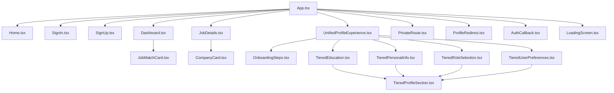

# Component Usage Matrix

This document maps all components in the RightBoss Candidate Portal and tracks their usage across the application. This analysis helps identify which components are actively used, where they're imported, and which ones are candidates for consolidation or removal.

## File Organization

The analysis is organized by directory and component type:

1. **Pages**: Primary route components
2. **UI Components**: Base UI elements
3. **Feature Components**: Specialized feature-specific components
4. **Layout Components**: Structural layout elements
5. **Profile Components**: Profile-related components
6. **Context Providers**: State management providers

## Active Components

### Pages

| Component | File Path | Imported By | Status | Notes |
|-----------|-----------|-------------|--------|-------|
| `Home` | src/pages/Home.tsx | App.tsx | ✅ Active | Landing page |
| `SignIn` | src/pages/SignIn.tsx | App.tsx | ✅ Active | Authentication page |
| `SignUp` | src/pages/SignUp.tsx | App.tsx | ✅ Active | Registration page |
| `Dashboard` | src/pages/Dashboard.tsx | App.tsx | ✅ Active | Main user dashboard |
| `JobDetails` | src/pages/JobDetails.tsx | App.tsx | ✅ Active | Job listing details |
| `UnifiedProfileExperience` | src/pages/UnifiedProfileExperience.tsx | App.tsx | ✅ Active | Combined profile/onboarding |
| `ProfileUnified` | src/pages/ProfileUnified.tsx | None | ❌ Unused | Possible duplicate of UnifiedProfileExperience |

### UI Components

| Component | File Path | Imported By | Status | Notes |
|-----------|-----------|-------------|--------|-------|
| `Button` | src/components/ui/Button.tsx | Multiple pages | ✅ Active | Primary button component |
| `Card` | src/components/ui/Card.tsx | Multiple components | ✅ Active | Base card container |
| `Input` | src/components/ui/Input.tsx | Form components | ✅ Active | Text input component |
| `Avatar` | src/components/ui/Avatar.tsx | Header, profile sections | ✅ Active | User avatar display |
| `LoadingScreen` | src/components/ui/LoadingScreen.tsx | App.tsx, suspense fallbacks | ✅ Active | Loading spinner/screen |
| `ProgressBar` | src/components/ui/ProgressBar.tsx | Dashboard | ✅ Active | Basic progress indicator |
| `EnhancedProgressBar` | src/components/ui/EnhancedProgressBar.tsx | None | ❌ Unused | Advanced progress visualization |
| `DebugController` | src/components/ui/DebugController.tsx | None | ❌ Unused | Debug tools for development |
| `theme` | src/components/ui/theme.ts | None | ❌ Unused | Theme configuration |

### Feature Components

| Component | File Path | Imported By | Status | Notes |
|-----------|-----------|-------------|--------|-------|
| `JobMatchCard` | src/components/features/JobMatchCard.tsx | Dashboard | ✅ Active | Job listing card |
| `CompanyCard` | src/components/features/CompanyCard.tsx | JobDetails | ✅ Active | Company information display |
| `OnboardingSteps` | src/components/features/OnboardingSteps.tsx | UnifiedProfileExperience | ✅ Active | Onboarding step tracker |
| `EnhancedOnboardingSteps` | src/components/features/EnhancedOnboardingSteps.tsx | None | ❌ Unused | Alternative onboarding implementation |
| `JobDetailsModal` | src/components/features/JobDetailsModal.tsx | None | ❌ Unused | Modal version of job details |
| `ProfileSectionNav` | src/components/features/ProfileSectionNav.tsx | None | ❌ Unused | Navigation for profile sections |
| `ChatInterface` | src/components/features/ChatInterface.tsx | None detected | ❓ Unclear | Chat functionality component |
| `SkillRadarChart` | src/components/features/SkillRadarChart.tsx | Possibly Dashboard | ❓ Unclear | Visualization for skills |

### Layout Components

| Component | File Path | Imported By | Status | Notes |
|-----------|-----------|-------------|--------|-------|
| `Header` | src/components/layout/Header.tsx | Multiple pages | ✅ Active | Application header |

### Auth and Route Components

| Component | File Path | Imported By | Status | Notes |
|-----------|-----------|-------------|--------|-------|
| `PrivateRoute` | src/components/PrivateRoute.tsx | App.tsx | ✅ Active | Protected route wrapper |
| `ProfileRedirect` | src/components/ProfileRedirect.tsx | App.tsx | ✅ Active | Profile status-based redirect |
| `AuthCallback` | src/components/AuthCallback.tsx | App.tsx | ✅ Active | Auth callback handler |

### Profile Components

#### Profile Hooks

| Component | File Path | Imported By | Status | Notes |
|-----------|-----------|-------------|--------|-------|
| `useInterview` | src/components/profile/hooks/useInterview.ts | None | ❌ Unused | Interview functionality hook |
| `useProfileNavigation` | src/components/profile/hooks/useProfileNavigation.ts | None | ❌ Unused | Profile section navigation |
| `useProfileSave` | src/components/profile/hooks/useProfileSave.ts | None | ❌ Unused | Profile data saving |
| `useRoleSelection` | src/components/profile/hooks/useRoleSelection.ts | None | ❌ Unused | Role selection functionality |

#### Profile Sections

| Component | File Path | Imported By | Status | Notes |
|-----------|-----------|-------------|--------|-------|
| `TieredEducation` | src/components/profile/sections/TieredEducation.tsx | UnifiedProfileExperience | ✅ Active | Education information section |
| `TieredPersonalInfo` | src/components/profile/sections/TieredPersonalInfo.tsx | UnifiedProfileExperience | ✅ Active | Personal information section |
| `TieredProfileSection` | src/components/profile/sections/TieredProfileSection.tsx | Multiple profile sections | ✅ Active | Base profile section component |
| `TieredRoleSelection` | src/components/profile/sections/TieredRoleSelection.tsx | UnifiedProfileExperience | ✅ Active | Role selection section |
| `TieredUserPreferences` | src/components/profile/sections/TieredUserPreferences.tsx | UnifiedProfileExperience | ✅ Active | User preferences section |
| `WelcomeSection` | src/components/profile/sections/WelcomeSection.tsx | None | ❌ Unused | Welcome section |
| `RoleSelector` | src/components/profile/sections/RoleSelector.tsx | None | ❌ Unused | Possible duplicate of TieredRoleSelection |

#### Profile UI Components

| Component | File Path | Imported By | Status | Notes |
|-----------|-----------|-------------|--------|-------|
| `SaveFeedback` | src/components/profile/ui/SaveFeedback.tsx | None | ❌ Unused | Save operation feedback |
| `SectionFooter` | src/components/profile/ui/SectionFooter.tsx | None | ❌ Unused | Footer for profile sections |
| `SectionWrapper` | src/components/profile/ui/SectionWrapper.tsx | None | ❌ Unused | Wrapper for profile sections |
| `ThemedCard` | src/components/profile/ui/ThemedCard.tsx | None | ❌ Unused | Themed card variant |
| `ProfileHeader` | src/components/profile/ui/ProfileHeader.tsx | None | ❌ Unused | Header for profile sections |

### Context Providers

| Component | File Path | Imported By | Status | Notes |
|-----------|-----------|-------------|--------|-------|
| `UserContext` | src/contexts/UserContext.tsx | None | ❌ Unused | Referenced in README but not imported |
| `ProfileContext` | src/contexts/ProfileContext.tsx | None | ❌ Unused | Referenced in README but not imported | 
| `ThemeContext` | src/contexts/ThemeContext.tsx | None | ❌ Unused | Referenced in README but not imported |

### Libraries and Utilities

| Component | File Path | Imported By | Status | Notes |
|-----------|-----------|-------------|--------|-------|
| `supabase` | src/lib/supabase.ts | Direct component imports | ✅ Active | Supabase client configuration |
| `auth` | src/lib/auth.tsx | None | ❌ Unused | Auth utilities |

## Import Relationships

## Consolidation Candidates

Based on this analysis, the following components are candidates for consolidation:

1. **Card Components**: `Card.tsx`, `ThemedCard.tsx`, `SectionWrapper.tsx`
2. **Progress Components**: `ProgressBar.tsx`, `EnhancedProgressBar.tsx`
3. **Role Selection**: `RoleSelector.tsx`, `TieredRoleSelection.tsx`
4. **Onboarding Steps**: `OnboardingSteps.tsx`, `EnhancedOnboardingSteps.tsx`
5. **Profile Experience**: `UnifiedProfileExperience.tsx`, `ProfileUnified.tsx`

## Removal Candidates

The following components show no usage and are candidates for removal:

1. **Unused Profile Hooks**: All hooks in `src/components/profile/hooks/`
2. **Unused UI Components**: `DebugController.tsx`, `theme.ts`
3. **Unused Profile UI**: `SaveFeedback.tsx`, `SectionFooter.tsx`, etc.
4. **Unused Context Providers**: All context providers

## Next Steps

1. Verify usage status of unclear components
2. Document dependencies between active components
3. Create test coverage map for active components
4. Establish priority order for consolidation 