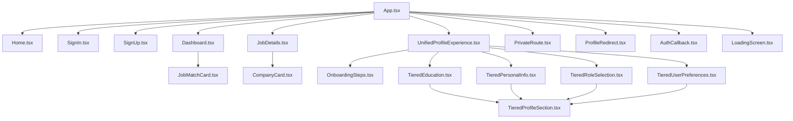

# RightBoss Candidate Portal

## Project Overview

RightBoss Candidate Portal is a React web application designed to streamline the job application and candidate onboarding experience. The platform connects job seekers with suitable opportunities while providing a comprehensive profile management system.

## Features

- **User Authentication**: Secure login and signup using Supabase authentication
- **Profile Management**: Tiered profile creation and editing experience
- **Job Matching**: View and apply to job opportunities based on profile data
- **Onboarding Flow**: Guided user onboarding experience for new users
- **Dashboard**: Centralized view of applications, matches, and profile completion
- **Role-Based Experiences**: Tailored experiences based on selected job roles

## Technology Stack

- **Frontend**: React 18.3, React Router 6
- **UI Components**: Custom components with TailwindCSS
- **Data Management**: Direct Supabase API calls with local state (see Architecture notes)
- **Authentication & Database**: Supabase
- **Build Tools**: Vite, TypeScript, ESLint

## Current Architecture

Based on our detailed analysis, the current architecture differs from the intended design in several key ways:

### Intended vs. Actual Architecture

**Intended Architecture**:
```
┌─────────────┐     ┌─────────────┐     ┌─────────────┐     ┌─────────────┐
│ Components  │     │  Context    │     │  Supabase   │     │  Database   │
│ (consumers) │◄───►│  Providers  │◄───►│   Client    │◄───►│   Tables    │
└─────────────┘     └─────────────┘     └─────────────┘     └─────────────┘
```

**Actual Architecture**:
```
┌─────────────────┐     ┌─────────────────┐     ┌─────────────────┐
│   Components    │     │   Direct API    │     │    Supabase     │
│  (with local    │◄───►│    Calls to     │◄───►│    Database     │
│     state)      │     │    Supabase     │     │                 │
└─────────────────┘     └─────────────────┘     └─────────────────┘
```

### Key Findings

1. **Context API Not Implemented**: While context provider files exist, they are not used in the application. State is managed locally in components.

2. **Direct API Calls**: Components make direct Supabase calls, creating tight coupling between UI and data layers.

3. **Component Redundancy**: 48% of TypeScript files are unused, and many remaining components have overlapping functionality.

4. **Inconsistent Patterns**: Data fetching, state management, and UI patterns vary across components.

For details on these findings, see the [STATE_MANAGEMENT_ANALYSIS.md](./STATE_MANAGEMENT_ANALYSIS.md) and [DATA_PATTERNS.md](./DATA_PATTERNS.md) documents.

## Component Structure

Our component analysis has identified the following actively used components:

### Core Active Components

- **Entry Point**: `App.tsx` → Routing configuration
- **Pages**: Home, SignUp, SignIn, Dashboard, JobDetails, UnifiedProfileExperience
- **Auth Components**: PrivateRoute, ProfileRedirect, AuthCallback
- **UI Components**: Button, Input, Card, Avatar, LoadingScreen
- **Feature Components**: JobMatchCard, CompanyCard, OnboardingSteps

### Component Relationship



For a complete analysis of component usage, see [COMPONENT_USAGE_MATRIX.md](./COMPONENT_USAGE_MATRIX.md).

## Technical Debt Overview

Our analysis has identified the following technical debt issues:

1. **Component Redundancy**
   - 48% of TypeScript files are currently unused
   - Multiple components with overlapping functionality
   - Inconsistent component patterns

2. **State Management Issues**
   - No abstraction layer between components and Supabase
   - Context providers created but not implemented
   - Duplicate data fetching logic across components

3. **Testing Challenges**
   - Tight coupling makes components difficult to test
   - No apparent test coverage
   - No standardized testing approach

4. **Maintenance Issues**
   - Changes to data structure require updates in multiple files
   - Inconsistent error handling
   - Challenging to implement application-wide features

## Improvement Plan

We've developed a comprehensive plan to address these issues:

### Phase 1: Documentation & Analysis (Completed)
- ✅ Map component usage and dependencies
- ✅ Document actual state management patterns
- ✅ Analyze data fetching patterns
- ✅ Create testing strategy
- ⏳ Update README with findings (this document)

### Phase 2: Core Architecture Setup (Next Steps)
- Implement service layer (Auth, Profile, Jobs, Onboarding)
- Create custom hooks for data access
- Set up testing framework
- Implement shared utilities

### Phase 3: UI Components Consolidation
- Consolidate Card components
- Consolidate Progress components
- Consolidate Role Selection components
- Consolidate Onboarding components

### Phase 4: Integration & Implementation
- Refactor pages to use new architecture
- Remove unused files
- Enhance documentation
- Implement tests

For detailed implementation steps, timelines, and responsibilities, see [IMPLEMENTATION_PLAN.md](./IMPLEMENTATION_PLAN.md).

## Project Structure

```
src/
├── components/         # Reusable UI components
│   ├── features/       # Feature-specific components 
│   ├── layout/         # Layout components (header, etc.)
│   ├── profile/        # Profile-related components
│   │   ├── hooks/      # Custom hooks for profile functionality
│   │   ├── sections/   # Different sections of the profile
│   │   └── ui/         # UI components specific to profiles
│   └── ui/             # Base UI components
├── config/             # Configuration files
├── contexts/           # React context providers (currently unused)
├── lib/                # Library modules (Supabase, auth)
├── pages/              # Page components
└── types/              # TypeScript type definitions
```

## Database Schema

The application uses a Supabase PostgreSQL database with the following main tables:

- **profiles**: User profile information
- **user_preferences**: User preferences for job matching
- **user_onboarding**: Tracks onboarding progress and completion

Row-level security policies ensure users can only access their own data.

## Testing Strategy

We've developed a comprehensive testing strategy to support our architecture improvements:

- **Unit Testing**: Services, hooks, and UI components
- **Integration Testing**: Component compositions and data flow
- **End-to-End Testing**: Critical user flows

Our approach prioritizes testability through proper separation of concerns and dependency injection. For details, see [TESTING_STRATEGY.md](./TESTING_STRATEGY.md).

## Getting Started

1. Clone the repository
2. Install dependencies with `npm install`
3. Create a `.env` file with your Supabase credentials
4. Run the development server with `npm run dev`

## Deployment

The application can be built for production using:

```
npm run build
```

Built files will be located in the `dist` directory.

## Documentation Index

We have created comprehensive documentation to guide the improvement of this codebase:

### Analysis Documentation

- [**FOLDER_STRUCTURE.md**](./FOLDER_STRUCTURE.md): Detailed explanation of the project's folder structure, purpose of each directory, and key files.
- [**UNUSED_FILES.md**](./UNUSED_FILES.md): List of files not currently being used in the application, with explanations and recommendations.
- [**DATA_PATTERNS.md**](./DATA_PATTERNS.md): Analysis of current data fetching patterns and recommendations for standardization.
- [**STATE_MANAGEMENT_ANALYSIS.md**](./STATE_MANAGEMENT_ANALYSIS.md): Analysis of current state management patterns and recommendations for improvement.
- [**TESTING_STRATEGY.md**](./TESTING_STRATEGY.md): Comprehensive testing approach for the application.

### Implementation Plans

- [**COMPONENT_CONSOLIDATION.md**](./COMPONENT_CONSOLIDATION.md): Strategy for consolidating redundant components, with examples and implementation details.
- [**IMPLEMENTATION_PLAN.md**](./IMPLEMENTATION_PLAN.md): Detailed project plan with specific tasks, durations, and dependencies for technical debt reduction and architecture improvements.
- [**IMPLEMENTATION_PROGRESS.md**](./IMPLEMENTATION_PROGRESS.md): Tracking document for implementation progress.

## Contributing

When contributing to this project, please follow the guidelines in our documentation:

1. Review the component structure and usage matrix before making changes
2. Follow the testing strategy for all new code
3. Adhere to the architectural patterns we're implementing
4. Update relevant documentation when making significant changes 