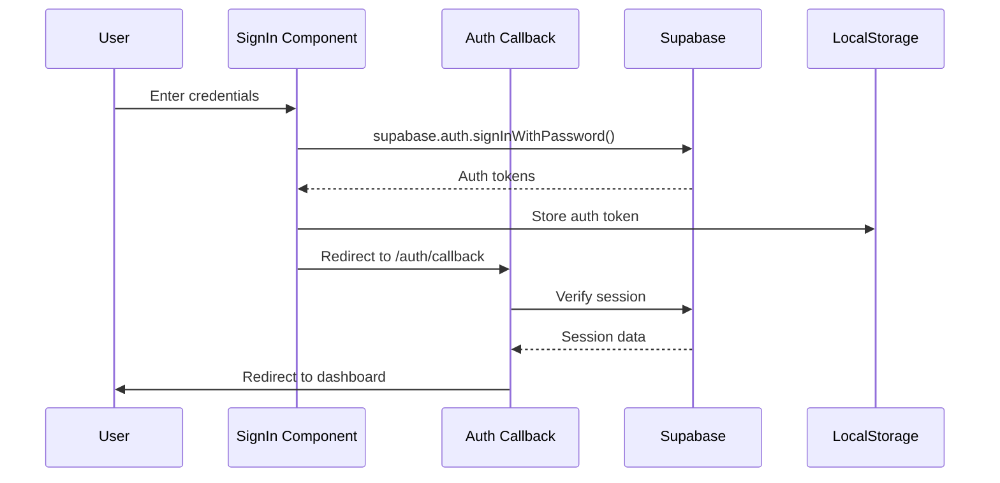
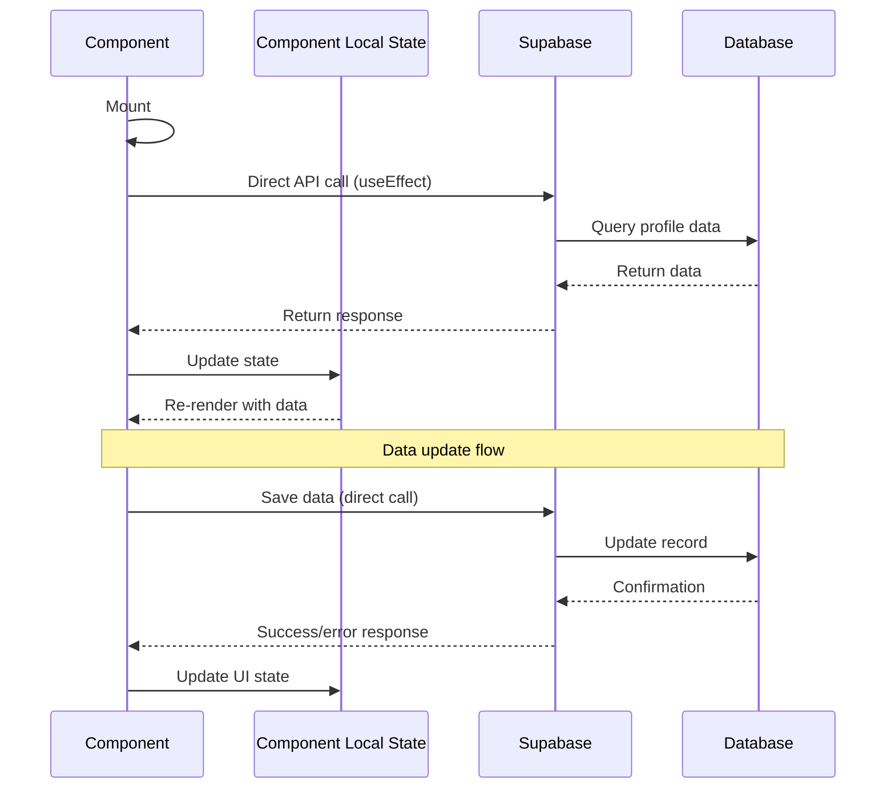

# State Management Analysis

This document analyzes the current state management patterns used in the RightBoss Candidate Portal application, identifying the gap between intended and actual implementation, and providing recommendations for standardization.

## Executive Summary

Our analysis reveals a significant discrepancy between the documented state management approach (React Context API) and the actual implementation. Despite having Context provider files, the application primarily uses local component state with direct Supabase calls. This creates challenges for testing, data synchronization, and code maintenance.

## Intended vs. Actual State Management

### Intended Architecture (Per Documentation)

The README and project documentation suggest a state management architecture using React Context providers:

```
┌─────────────┐     ┌─────────────┐     ┌─────────────┐     ┌─────────────┐
│ Components  │     │  Context    │     │  Supabase   │     │  Database   │
│ (consumers) │◄───►│  Providers  │◄───►│   Client    │◄───►│   Tables    │
└─────────────┘     └─────────────┘     └─────────────┘     └─────────────┘
```

Key intended providers:
- `UserContext.tsx`: Managing authentication state
- `ProfileContext.tsx`: Managing profile data
- `ThemeContext.tsx`: Managing application theme

### Actual Implementation

Based on the component usage analysis, the actual implementation uses:

```
┌─────────────────┐     ┌─────────────────┐     ┌─────────────────┐
│   Components    │     │   Direct API    │     │    Supabase     │
│  (with local    │◄───►│    Calls to     │◄───►│    Database     │
│     state)      │     │    Supabase     │     │                 │
└─────────────────┘     └─────────────────┘     └─────────────────┘
```

Key observations:
- Context providers exist but are not imported by any components
- Components make direct Supabase API calls
- State is managed locally using React's useState hook
- No centralized state management for shared data

## Detailed State Management Patterns

### Authentication State Management

**Intended Pattern:**
```jsx
// Example from documentation
import { useUser } from '../contexts/UserContext';

function ProtectedComponent() {
  const { user, loading } = useUser();
  
  if (loading) return <LoadingScreen />;
  if (!user) return <Navigate to="/signin" />;
  
  return <div>Protected content</div>;
}
```

**Actual Pattern:**
```jsx
// Based on component analysis
function PrivateRoute({ children }) {
  const [user, setUser] = useState(null);
  const [loading, setLoading] = useState(true);
  
  useEffect(() => {
    async function checkAuth() {
      setLoading(true);
      const { data } = await supabase.auth.getSession();
      setUser(data?.session?.user || null);
      setLoading(false);
    }
    
    checkAuth();
  }, []);
  
  if (loading) return <LoadingScreen />;
  if (!user) return <Navigate to="/signin" />;
  
  return children;
}
```

### Profile Data Management

**Intended Pattern:**
```jsx
// Example from documentation
import { useProfile } from '../contexts/ProfileContext';

function ProfileComponent() {
  const { profile, updateProfile, loading } = useProfile();
  
  // Component code using profile context
}
```

**Actual Pattern:**
```jsx
// Based on component analysis
function ProfileComponent() {
  const [profile, setProfile] = useState(null);
  const [loading, setLoading] = useState(true);
  
  useEffect(() => {
    async function fetchProfile() {
      const { data, error } = await supabase
        .from('profiles')
        .select('*')
        .eq('id', userId)
        .single();
        
      if (!error) {
        setProfile(data);
      }
      setLoading(false);
    }
    
    fetchProfile();
  }, [userId]);
  
  // Component code using local state
}
```

### Form State Management

**Actual Pattern:**
```jsx
// Common pattern found in form components
function FormComponent() {
  const [formData, setFormData] = useState({
    field1: '',
    field2: '',
    // ...other fields
  });
  
  const handleChange = (e) => {
    setFormData(prev => ({
      ...prev,
      [e.target.name]: e.target.value
    }));
  };
  
  const handleSubmit = async (e) => {
    e.preventDefault();
    
    // Direct Supabase call
    const { error } = await supabase
      .from('some_table')
      .upsert({ ...formData, user_id: userId });
      
    // Handle response
  };
  
  // Form rendering
}
```

## Current State Flow Diagrams

### Authentication Flow



### Profile Data Flow



## Issues with Current Implementation

1. **Duplicate Data Fetching Logic**
   - Same data fetching code repeated across components
   - No centralized error handling
   - Inconsistent loading state patterns

2. **Data Synchronization Challenges**
   - No mechanism to synchronize data across components
   - Changes in one component don't propagate to others
   - Potential for stale data when navigating between screens

3. **Testing Difficulties**
   - Components tightly coupled to Supabase
   - Difficult to mock API responses for testing
   - No separation between data and UI logic

4. **No Global Application State**
   - Authentication state managed independently in components
   - No single source of truth for user data
   - Error and status messages handled locally

5. **Code Maintenance**
   - Changes to data structure require updates in multiple files
   - Inconsistent error handling approaches
   - Difficult to implement application-wide features

## Recommendations

### 1. Implement Service Layer

Create a service layer to abstract Supabase calls:

```jsx
// services/profileService.js
export const ProfileService = {
  async getProfile(userId) {
    try {
      const { data, error } = await supabase
        .from('profiles')
        .select('*')
        .eq('id', userId)
        .single();

      if (error) throw error;
      return { data };
    } catch (error) {
      return { error: error.message };
    }
  },
  
  // Other methods
};
```

### 2. Implement Custom Hooks

Create custom hooks for data access:

```jsx
// hooks/useProfile.js
export function useProfile(userId) {
  const [state, setState] = useState({
    data: null,
    loading: true,
    error: null
  });
  
  useEffect(() => {
    async function loadProfile() {
      setState(s => ({ ...s, loading: true }));
      const { data, error } = await ProfileService.getProfile(userId);
      setState({ data, loading: false, error });
    }
    
    loadProfile();
  }, [userId]);
  
  return state;
}
```

### 3. Implement Context for Shared State

Focus on implementing Contexts only for truly global state:

```jsx
// contexts/AuthContext.jsx
export function AuthProvider({ children }) {
  const [session, setSession] = useState(null);
  const [loading, setLoading] = useState(true);
  
  useEffect(() => {
    // Setup Supabase auth subscription
    const { data } = supabase.auth.onAuthStateChange((event, session) => {
      setSession(session);
      setLoading(false);
    });
    
    return () => data.subscription.unsubscribe();
  }, []);
  
  return (
    <AuthContext.Provider value={{ session, loading }}>
      {children}
    </AuthContext.Provider>
  );
}
```

### 4. Consider React Query for Complex Data Needs

For more advanced data management, consider implementing React Query:

```jsx
// With React Query
export function useProfileQuery(userId) {
  return useQuery(
    ['profile', userId],
    () => ProfileService.getProfile(userId),
    {
      enabled: !!userId,
      staleTime: 5 * 60 * 1000, // 5 minutes
    }
  );
}
```

## Implementation Priority

1. **Authentication State Management**
   - Highest priority due to security implications
   - Implement AuthContext first

2. **Profile Data Management**
   - Critical for user experience
   - Create profile service and hooks

3. **Form State Management**
   - Standardize form handling patterns
   - Create reusable form hooks

4. **UI State Management**
   - Theme, preferences, and other UI state
   - Lower priority but improves consistency

## Conclusion

The current state management in RightBoss Candidate Portal differs significantly from the documented architecture. Implementing the recommended patterns will create a more maintainable, testable codebase with better data synchronization and error handling. The focus should be on creating a service layer first, followed by custom hooks, and then selectively implementing Context providers for truly global state. 